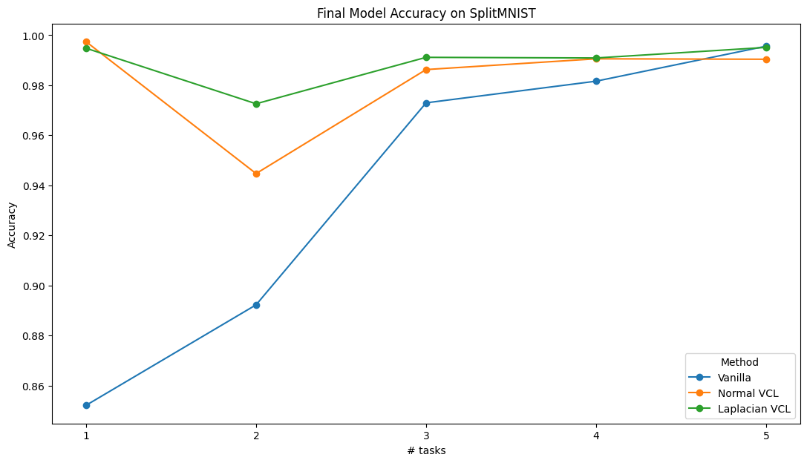
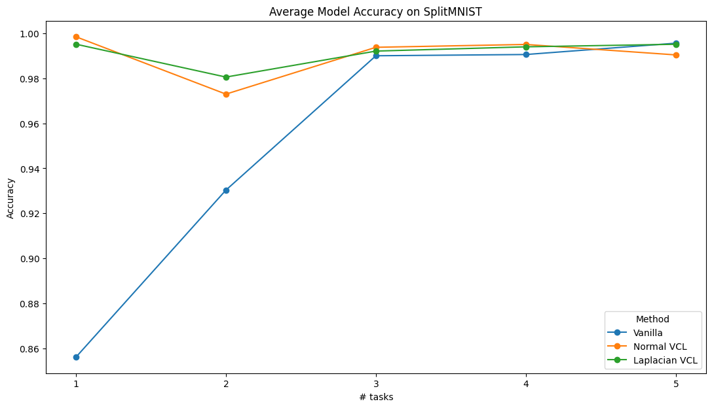

# Variational Continual Learning with Non-Gaussian Variational Distributions

PyTorch implementation + improvement of [Variational Continual Learning (Ngyuen et al.)](https://arxiv.org/abs/1710.10628) using Laplacian variational distribution. 

All modules and experiments can be found in the `laplacian-VCL.ipynb` notebook (which may render properly in your GitHub if one is lucky).
We invite those curious to try out different hyperparameter configurations and see the resulting changes.

Read our [full report on Overleaf](https://www.overleaf.com/read/pnpcphbyxwjq#17b80b).

Utilizing the same experimental setup as VCL, we find that Laplacian variation leads to superior performance at the end of training:

as well as throughout the learning process:

